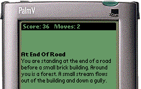
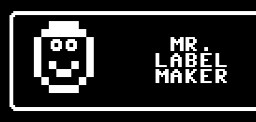

# [64K BASIC](https://www.basic-lang.org/)

I wanted to get good at Rust so I wrote a compiler for an entirely different language. The lingua franca of 70s and 80s personal computers, BASIC programs were widely distributed in books and magazines for users to type in. What started as a learning exercise turned into a preservation project.

# [Peaberry SDR](peaberry)
{: .right}
{: .right}

This is a ham radio transceiver I sold for a few years. Reviews live on in the
[November 2013 issue of QST](http://www.arrl.org/files/file/QST/This%20Month%20in%20QST/November%202013/TOC.pdf) pg 57-59
and on [eHam](https://www.eham.net/reviews/view-product?id=10690)
[(alt)](https://www.eham.net/reviews/view-product?id=11577).

It uses a quadrature mixer to sample I/Q with a Sigma-Delta ADC/DAC and
connects as a USB device. The radio has its own
[PC and Mac software](https://github.com/AE9RB/peaberry-cw)
written in C++. The Cypress PSoC was programmed in
[C and Verilog](https://github.com/AE9RB/peaberry).

# [Arduino Iambic Keyer](https://github.com/AE9RB/iambino)
{: .right}

This is a device radio operators use to send morse code. I forced myself to build it on Arduino which made the project expensive and complicated. But it works perfectly with shaped sine waves and zero-lag.

# [Frobnitz](http://frobnitz.sourceforge.net/)
{: .right}

The text adventures from Infocom ran on a VM called the
[Z-machine](https://en.wikipedia.org/wiki/Z-machine).
Making it run on Palm simply required the VM to be implemented as a state machine.

# [Mr. Label Maker](assets/labelmaker.d64.zip)
{: .right}

For the [Commodore 64](https://en.wikipedia.org/wiki/Commodore_64).
Create labels for your 5.25" floppy diskettes using the built-in
graphics editor. The source and manual are lost to time, but this
is a cracked copy that survived because of the warez scene.
